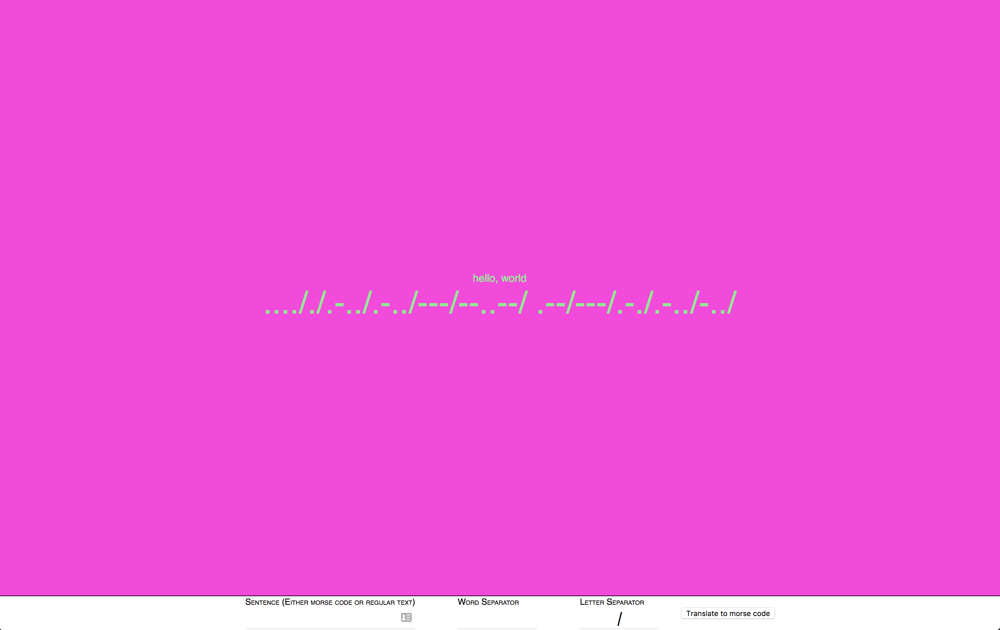

# Morse code translator

This was a pairing excersize with my squad at work to learn about how we can pair with vim and tmux.
I did a little polishing to it, and converted it to use react because it made it easier to componentize the input fields.


## How to run this:

You will need [nvm](https://github.com/creationix/nvm) or node 8.

To install:

```bash
npm install -g yarn
yarn
```

To run:

```bash
yarn start
```

And go to [localhost:8080](http://localhost:8080)

You should see a page that looks like:


